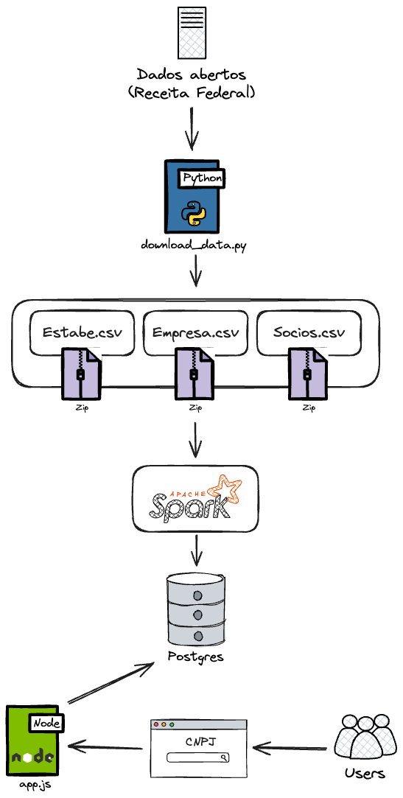

# Consultar CNPJ

O projeto **Consultar CNPJ** simplifica a consulta a dados de CNPJ fornecidos pela Receita Federal por meio de uma API. Os dados podem ser acessados e baixados diretamente de [Receita Federal - Dados Abertos](https://dadosabertos.rfb.gov.br/CNPJ/), onde são disponibilizados em arquivos .zip, contendo diversos arquivos .csv.

## Desafios do Projeto

1. **Download e Tamanho dos Arquivos**: 
   - O conjunto de dados compreende aproximadamente 5,8 GB, distribuídos em múltiplos arquivos.
   - A baixa velocidade de download, com tempo estimado entre 2 e 3 horas, exige soluções para otimizar este processo.

2. **Organização e Formatação dos Dados**:
   - Após o download, os arquivos precisam ser agregados e ajustados conforme o [dicionário de dados](https://www.gov.br/receitafederal/dados/cnpj-metadados.pdf).

3. **Consulta Rápida e Escalabilidade**:
   - A aplicação deve suportar consultas rápidas e ser capaz de lidar com múltiplas requisições simultâneas.

## Arquitetura e Tecnologias

### Backend e Processamento de Dados

- **Python e PySpark**: Utilizados para download, organização e processamento dos arquivos, devido à capacidade de manipulação de grandes volumes de dados, mesmo em ambientes com recursos limitados.
- **PostgreSQL**: Banco de dados escolhido pela sua leveza e popularidade, permitindo consultas rápidas (sub-100ms) através da utilização de índices.

### Estrutura de Dados

- A estrutura de dados no PostgreSQL replica a dos arquivos originais, evitando junções complexas durante o processamento e focando em um armazenamento eficiente. As consultas são otimizadas através de índices, mantendo a integridade e a eficiência nos JOINs.

### API

- **Node.js**: A API, localizada na pasta `app`, facilita a interface com os dados.

## Instruções de Instalação

1. Configure o arquivo `.env` a partir do modelo `.example-env`, com as credenciais do banco de dados PostgreSQL.
2. Execute `download_data.py` para baixar os arquivos .csv compactados da Receita Federal.
3. Utilize `move_file.sh` para organizar e descomprimir os arquivos baixados.
4. Execute `run_generators.sh` para processar os arquivos .csv e armazenar os dados no PostgreSQL.
5. (Opcional) Execute a interface da API localizada na pasta `app`.

---

Esta abordagem visa uma integração robusta e eficiente dos dados de CNPJ, promovendo um sistema escalável e de alta performance.
